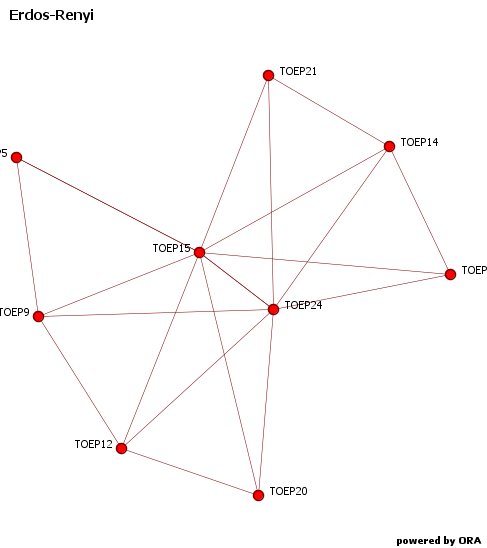
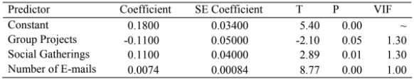
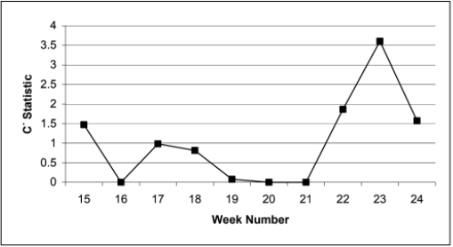
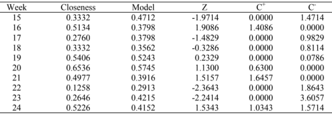
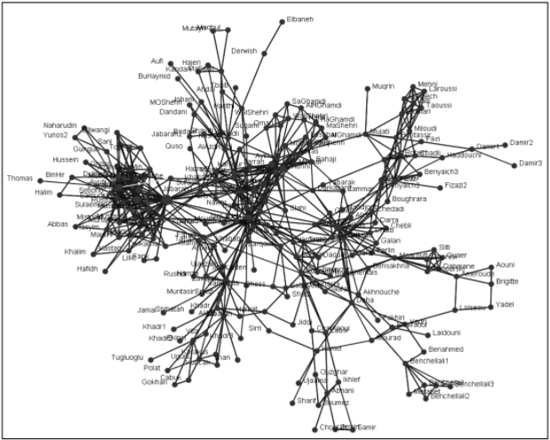
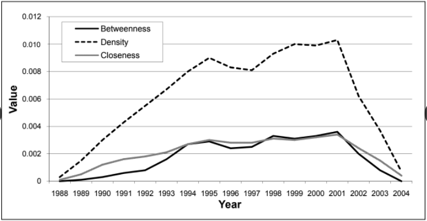

```{r setup, include=FALSE}
options(htmltools.dir.version = FALSE)
```

class: center, middle


## **Submitted by:**

### Hernán David Torres Cardona

## **Professor:**

### Rubén Darío Guevara

---
class: inverse, center, middle

# Introduction

---

# Social Networks Analysis: Research Requirement

**Social networks** may signal **change** within an organization, and may even **predict** significant events or behaviors.

.footnote[
[1] McCulloh, I., Webb, M., Graham, J., Carley, K., & Horn, D. B. (2008). Change detection in social networks. Military Academy Dept Mathematical sciences. [PDF](http://www.dtic.mil/get-tr-doc/pdf?AD=ADA484611)
]

--

Detect these changes enables 

* the **anticipation** and early **warning** of change and
* faster **response** to change.

--

### _*Procedure*_

By applying **Statistical Process Control** techniques 
to social networks we can detect these changes.


---

background-image: url(http://www.casos.cs.cmu.edu/projects/nukes/nukes.png)
background-size: 650px 550px

class: center, bottom, inverse

# [A Twitter retweet!](http://www.casos.cs.cmu.edu/projects/projects/hashtag_nukes.php)

---

# Organizations are not static

Their structure, composition, and patterns of communication may change **over time**.

--

A certain degree of change is expected in the **normal course** of an unchanging organization.

--

### _*The challenge*_
Develope metrics to detect **signals of meaningful change** in social networks in a background of normal variability.


---

# Social Network Change Detection

Previous methods may be effective at quantifying a difference in static networks, **but** they lack an underlying **statistical distribution**.

--

Now we want to improve significantly on previous attempts to detect organizational change over time.


--


### _*In what way?*_

By introducing a statistically sound **probability space** and uniformly more powerful **detection methods¨** we prevent an analyst from identifying a statiscally significant change.

--

We propose techniques from _*SNA**_, combined with those from _*SPC*_**.

.footnote[
[*] SNA: Social Networks Analysis

[**] SPC: Statistical Process Control
]

---
class: inverse, middle, center

#  Social Network Analysis

---

# Graphs


SNA provides the basis for how social networks are modeled, measured, compared and visualized. 


<center><iframe src="https://giphy.com/embed/b8032T9vBcIak" width="330" height="230" frameBorder="0" class="giphy-embed" allowFullScreen></iframe></center>

--

+ An **observed social network** can be modeled on a graph with people represented as **vertices** and links between them as **edges**. [1] 

.footnote[[1] (Scott, 2002; Wasserman & Faust, 1994) ]

--

+ Edges may be weighted to show the importance of the link or may be directed to show who is initiating the link and who is receiving it. 


---

# Centrality Network Measures

Network measures can be calculated from the entire graph (**extrinsic attributes**) or for each individual node (**intrinsic attributes**).

--
.pull-left[

**Density**

How many links exist in the graph divided by the total number of possible links.

$$ d = \frac{\text{# edges}}{n(n-1)}$$
--

**Closeness centrality**

How a node is connected beyond its immediate neighbors.

$$c_k = \frac{\min_k\{\sum_{i=1}^n g_{ki}\}}{\sum_{i=1}^n g_{ki}}$$

]

--

.pull-right[
**Betweenness centrality**

How often a node lies along the shortest path, or geodesic, between two other nodes for all nodes in a graph.

$$b_k = \sum _{i,j} \frac{g_{ikj}}{g_{ij}}$$
+ $g_{ikj}$: the number of geodesic paths between nodes i and j crossing node k.

+ $g_{ij}$: total number of geodesic paths between nodes i and j.

]


---
class: inverse, middle, center

# Statistical Process Control

---

# Control charts

SPC is a technique used mostly to monitor industrial processes.

--

These detect changes in the **mean** of the process by taking periodic samples of the product and tracking the results against a **control limit**.

--

Control charts are usually optimized for their processes to increase their sensitivity for detecting changes, while minimizing the number of **false alarms**.

---
# CUSUM* Control Chart

The decision rule runs off the cumulative statistic

$$C_t = \sum_{j=1}^t (Z_i - k)$$

.footnote[[*] Cumulative Sum]

--

where $Z_i$ is the standardized normal of each observation and the common choice for $k$ is 0.5


--

This chart is well suited:

--
.pull-left[+ To detect small changes in the mean of a process over time.]

--

.pull-right[+ To found its built-in change point detection]

---
class: inverse, middle, center

# Methods and Result

---
 
 # Graph mesures

The average graph measures for
**density**, **closeness**, and **betweenness centrality** are calculated for several consecutive time periods of the social network.

--

+ The **“in-control” mean and variance** for the measures of the network are calculated by taking a sample average and sample variance of the **stabilized measures**.

--


+ The subsequent, successive social network measures are then used to calculate the CUSUM’s statistics.

--


+ Upon receiving a signal, the *change point** is calculated by tracing the signaling $C^+$ or $C^-$ statistic back to the last time period it was zero.

---

#Network mesures

The network measures of interest should follow or approximate a normal distribution due to the central limit theorem.

--

Each of the network measures was fit with five continuous distributions: normal, uniform, gamma, exponential, and chi-squared.

--

### _*The Problem*_
Gamma Distribution is the best fit for betweenness and density network
measures. This invalidated further usage of the CUSUM Control
Chart.

---

# Tactical Officer Eduaction Program

The TOEP officers agreed to allow data about their personal and professional e-mail communication to be tracked over a 24-week period.

--

There were subjects with incomplete communication and not identically distributed data collected . These were eliminated from further examination.

<p align="center">
  
</p>
---

## Normally distributed but too much variance

The planning calendar, combined with participant interviews, allowed investigators to determine the number of significant events from a variety of categories that occurred each week: 

+ Academic Requirements
+ The Next Week’s Academic Requirements
+ Administrative Events
+ Group Projects + Social Gatherings
+ Days Off.

--

_*Analysis of variance (ANOVA)*_

$$\text{Closeness} = 0.18 − 0.11(\text{Group Projects} ) + 0.11(\text{Social Gatherings}) + 0.0074(\text{Number of Emails})$$
<p align="center">
  
</p>

---

##  Closeness CUSUM

When is the model no longer providing a good prediction?

--

The $C_+$ and $C_-$ statistics were calculated for each week using a $k$ value of 0.5 and a control limit of 3.

<p align="center">
  
</p>

---

## Summary

<p align="center">
  
</p>
--

**Notices:**

+ An increase in group project work was correlated with a decrease in communication.

+ The residuals were verified as normally distributed to meet the prerequisites of the CUSUM Control Chart.

---

# Al-Qaeda Communications Network

The data are limited in that we do not know the type, frequency, or substance of the communication and all links are non-directional.

<p align="center">
  
</p>


---

## Averages for mesures

<p align="center">
  
</p>

--

**Notices**

+ There might be a significant change in the al-Qaeda network between the years 2000
and 2001. 

+ We would be alerted to a critical  change in the network prior to the September 11 terrorist attacks.

---
class: inverse, middle, center

# Conclusions

---

# Discussion and further work

+ Social network
monitoring can to detect important changes in the monitored communication of both command and control networks as well as terrorist networks.

+ Several difficulties were encountered when working with the datasets, for example, the completeness of the dataset.

+ Future research should focus on near-complete datasets with high resolution.

+ Networks with a set of good
predictors to explain varying behavior may be useful in  producing models that can be control charted.
---
class: center, middle, inverse

# Thanks!

Slides created via the R package [**xaringan**](https://github.com/yihui/xaringan).

